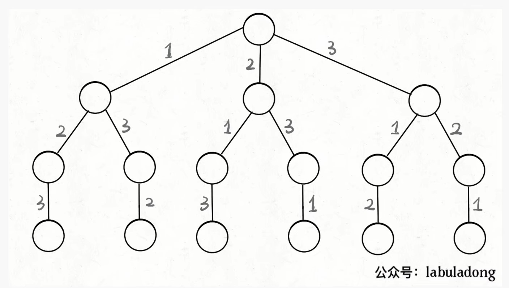
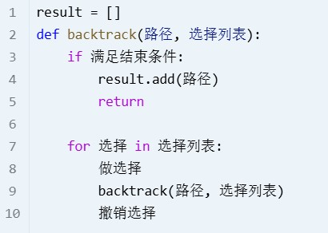

# 回溯 Backtracking
# Overview
回溯是递归的副产品 只要有递归，就会有回溯。

回溯其实就是暴力搜索，它的时间复杂度并不低。 因为回溯的本质是穷举，
穷举所有可能，然后选出我们想要的答案，如果想让回溯法高效一些，可以
加一些剪枝，但也改不了回溯法就是穷举的本质。

递归时间复杂度 = 递归函数时间复杂度 * 递归次数

它的核心思想是从一个初始状态出发，暴力搜索所有可能的解决方案，当遇
到正确的解则将其记录，直到找到解或者尝试了所有可能的选择都无法找到解为止。

回溯涉及尝试与回退，当当前条件不满足时，会回退到上一步，尝试其他的选择。

可以采用约束条件来pruning.

总结来说，其实就是遍历决策树的过程，每一个叶子节点都可能是一个合法决策，将整棵树
遍历一遍，将所有合法的叶子节点都找出来，就是所有的解

## 常见问题

- 组合问题：N个数里面按一定规则找出k个数的集合

  注意规避重复的元素 *startIndex* & *pruning*

- 切割问题：一个字符串按一定规则有几种切割方式
  - 不同的切割方式作为不同节点
- 子集问题：一个N个数的集合里有多少符合条件的子集
  - 其实就是组合问题的一个变形，不只收集叶子节点，而是收集所有节点
- 排列问题：N个数按一定规则全排列，有几种排列方式 显然可以抽象为树

  - 排列问题每层都是从0开始遍历 而不是startIndex
  - 需要一个used数组来记录已经选择的元素 保证排列内部的元素不重复


  

- 棋盘问题：N皇后，解数独等等 

  同样是将棋盘上的每个选择抽象为树的节点

组合无序，排列有序

所有回溯问题都可以抽象为树形结构(高度有限N叉树) 递归次数有限->高度有限；集合大小决定树宽度
## template
template @代码随想录
```
// arg always include path, choices 路径&选择列表
void backtracking(args) {
    // 终止条件 深度有限
    if (终止条件) {
        存放结果;   result.push_back(path);
        return;
    }

    // aka 选择 : 选择列表
    for (选择：本层集合中元素（树中节点孩子的数量就是集合的大小）) {
        处理节点 即做选择; 
        backtracking(路径，选择列表); // 递归
        回溯，撤销选择;
    }
}
```
template by labuladong



不要将回溯隐藏到递归，这样比较直观
